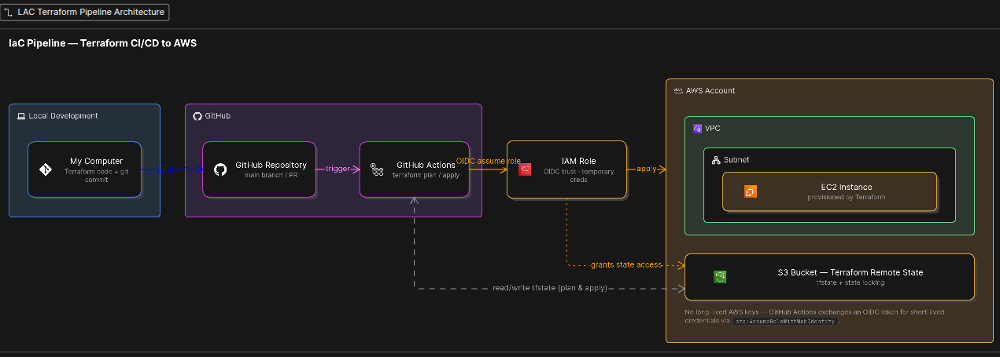

# Automated IaC Using Terraform

This is a simple Infrastructure as Code (IaC) pipeline that automatically creates AWS infrastructure using **Terraform** and **GitHub Actions**.

Instead of creating AWS resources manually from the AWS Console, I wrote Terraform configuration files that describe the infrastructure I want. GitHub Actions then runs Terraform automatically whenever I push changes to the `main` branch.

I made use **GitHub OIDC** to securely connect GitHub Actions to AWS without storing long lived AWS access keys in GitHub.

---

## Table of Contents

1. AWS Infrastructure
2. Terraform Remote State and State Locking
3. GitHub Actions Workflow
4. AWS Authentication with OIDC and IAM Permissions
5. Problems I Encountered

---

## Architecture




## Goal

My aim was to:

* Create AWS infrastructure using Terraform
* Build a VPC and Subnet (Custom Networking)
* Deploy an EC2 instance using Terraform
* Store Terraform state remotely in Amazon S3
* Automate Terraform with GitHub Actions
* Connect GitHub Actions to AWS using OIDC (instead of storing permanent AWS keys)


---

## AWS Infrastructure

With Terraform i was able to creates the following resources:

### Networking (VPC, Subnet, Internet Gateway, Route Table)

* VPC:This gives me an isolated private network (cloud environment) - CIDR: `10.0.0.0/16`
* Public Subnet: This gives the EC2 instance a public IP for public use - CIDR: `10.0.1.0/24`
* Internet Gateway: This is attached to the VPC and it connects the VPC to the internet.
* Route Table: This route internet traffic through the IGW (`0.0.0.0/0) to my VPC. 

### Security Group

Controls traffic to and from the EC2 instance.

* **Inbound SSH:** allowed only from my own public IP address, using a CIDR `/32`.

 
* **Outbound:** Since SG is stateful the EC2 instance can freely reach the internet for updates and package installs.

### EC2 Instance

Instance type: t3.micro  
Operating system: Amazon Linux 2023
```


##Terraform Remote State and State Locking##

*  I created an S3 bucket to store my state File.
- i made sure to enable Encryption, Versioning and ensured that all public access was disabled.
- S3 was the first thing i created and it was done manually because it needs it to exist before terraform can use it as backend.

* I created a DynamoDB for state locking.
- Locking prevents two Terraform runs from editing the state file at the same time (overwrite).
- This was removed because of an issue.

```

---

## GitHub Actions Workflow

Location: `.github/workflows/terraform.yml`

Triggers on every push to `main`:

```yaml
on:
  push:
    branches:
      - main
```

| Step | What it does |
|---|---|
| 1. `terraform init` | Connects to the S3 backend |
| 2. `terraform validate` | Checks the configuration structure is valid |
| 3. `terraform plan` | Compares live AWS state to the configuration and saves the plan as `tfplan` (uploaded as a workflow artifact) |
| 4. `terraform apply` | Applies the saved plan to AWS |

---

## AWS Authentication with OIDC and IAM Permissions
This was a security measure i took. I used GitHub Actions OIDC to avoid storing long lived AWS access keys in GitHub Secrets. Here GitHub Actions authenticates to AWS using an OIDC token, assumes a trusted IAM role and receives temporary credentials with only the permissions required by the deployment.


GitHub → OIDC → AWS IAM → IAM Role → Temporary credentials → Terraform

**OIDC** = OpenID Connect. This was created manually by me on the console. i attached the policy which included my github informations.

IAM role used: `github-actions-terraform-role`

### Example of the Trust policy 


```json
{
  "Version": "2012-10-17",
  "Statement": [
    {
      "Effect": "Allow",
      "Principal": {
        "Federated": "arn:aws:iam::<account-id>:oidc-provider/token.actions.githubusercontent.com"
      },
      "Action": "sts:AssumeRoleWithWebIdentity",
      "Condition": {
        "StringEquals": {
          "token.actions.githubusercontent.com:aud": "sts.amazonaws.com"
        },
        "StringLike": {
          "token.actions.githubusercontent.com:sub": "repo:<github-username>/<repo-name>:ref:refs/heads/main"
        }
      }
    }
  ]
}
```

* NOTE: The `sub` condition was important — it restricts the role so **only workflows running on `main` in this specific repo** can assume it not just any GitHub Actions workflow anywhere.

---

**IAM Permissions** = This determines the specific task the terraform can do when it assumes the role (principle of least privilage).

I created an IAM role: `github-actions-terraform-role` and assigned a permission policy to it.

The permissions policy grants access to:

* EC2
* VPC, Subnets, Route Tables, Internet Gateway
* Security Groups
* S3 (Terraform state bucket + objects)
* S3 state locking


---

## What Each Terraform File Does

| File | Purpose |
|---|---|
| `main.tf` | Defines the VPC, subnet, internet gateway, route table, route table association, security group, EC2 instance, and AMI lookup |
| `variables.tf` | Declares input variables e.g. `admin_ip` (see below) so nothing sensitive is hardcoded |
| `provider.tf` | Configures the AWS provider and region (`us-east-1`) |
| `versions.tf` | Pins the required Terraform and AWS provider versions |
| `backend.tf` | Points Terraform to the remote S3 backend for state storage |

```hcl
variable "admin_ip" {
  description = "Public IPv4 address allowed to SSH into the EC2 instance"
  type        = string
}
```

I pass my IP into Terraform via a GitHub Actions secret rather than hardcoding it in the Security Group configuration, this keeps it out of version control.


---

## Problems I Encountered

1. I had an issue acquiring state lock when i ran terraform plan.

- solution: i ran a code on S3 bucket and found there was two locks on the bucket due to a previous failed terraform lock, so i removed the old lock.

2. A deprecated DynamoDB.

- solution: i removed DynamoDB lock configuration and used the one AWS suggested which was S3 native state lock.

3. i had issues with my IP address (came out invalid).

- solution: i realized that terraform wanted a CIDR block, so i added /32

4. My github action had a problem assuming the AWS IAM role

- solution: i had to check the OIDC configuration (trusted policy) and IAM role permission then realised i did not specify the github identity in the configuration.


---

## Project Status

**Completed and successfully deployed to AWS.** The GitHub Actions pipeline runs Terraform and updates the infrastructure automatically on every push to `main`.
